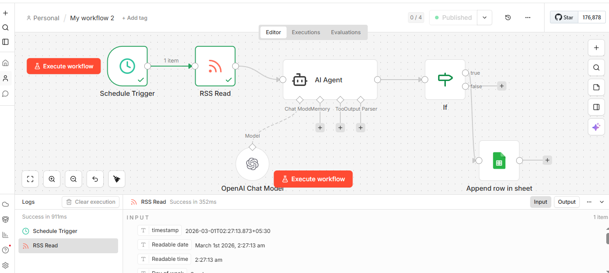

# ai-smart-job-hunter
AI-driven job monitoring automation built with n8n, OpenAI API, and Google Sheets. Automatically filters walk-in job opportunities from RSS feeds and stores matched results in a structured workflow running 24/7.

## ⚙️ Workflow Architecture (n8n)

This project is built using **n8n**, an open-source workflow automation platform.

The workflow performs the following steps:

1. Schedule Trigger runs automatically (24/7 monitoring)
2. RSS Read fetches job alerts
3. OpenAI filters only walk-in relevant jobs
4. Conditional logic checks AI output
5. Google Sheets node stores matching jobs

### 🛠 Technologies Used

- n8n (Workflow Automation)
- OpenAI API (AI Filtering)
- Google Sheets API (Data Storage)
- RSS Feeds (Job Monitoring)

---
## 🖼 Workflow Screenshot

## 📂 Sample CSV Export

You can also view the exported CSV file here:

[Download CSV Output](sample-output.csv)
